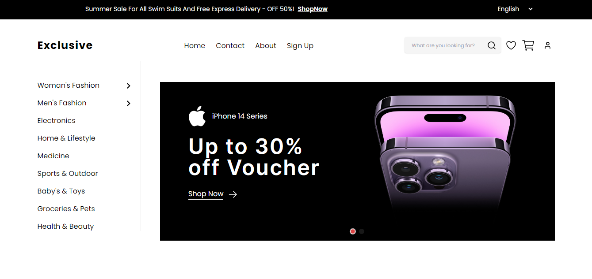

# E-Commerce Website

The E-commerce website is a application built using React with Vite as the bundler. It incorporates Tailwind CSS for styling for components, offering a sleek and modern user interface. The platform provides essential functionalities such as signup and login for users to access their accounts, wishlist and cart pages for managing items, search functionality to easily find products, and a profile section for personalization. Furthermore, it includes checkout processes with support for coupons and purchasing, ensuring a seamless shopping experience for customers.

## [🌟Live Website🌟](https://e-commerce-app-omega-two.vercel.app/)

## [🌟Design on Figma 🌟](https://www.figma.com/file/yn2DFQJla0UiSMvomFsqwT/E-Commerce-Website-%D9%90Almdrasa?type=design&mode=design&t=fqPRRAQH5lDJGmoY-0)



## Table of Contents

- [Features](#features)
- [Technologies Used](#technologies-used)
- [Set Up ](#set-up)
- [Contact](#contact)

## Featured Skills

1. **React**: Utilized for building the frontend interface, providing dynamic and interactive components.
2. **Vite**: Employed as the build tool to optimize and bundle the project for production.
3. **Tailwind CSS**: Integrated for responsive and customizable styling, enhancing the visual aesthetics of the website.
4. **User Authentication**: Implemented signup and login features to authenticate users and secure their accounts.
5. **FireStore**: Allocate a portion of memory to each user.
6. **Wishlist and Cart Management**: Developed functionalities to add, remove, and update items in the wishlist and cart, enhancing user engagement and convenience.
7. **Search Functionality**: Implemented a search feature to enable users to find products efficiently based on their preferences.
8. **Checkout Process**: Designed a seamless checkout process with support for applying coupons and completing purchases, streamlining the buying journey for users.

## Technologies Used

- **React**: JavaScript library for building user interfaces.
- **Vite**: Fast, modern build tooling for frontend development.
- **Tailwind CSS**: Utility-first CSS framework for rapid UI development.
- **Firebase**: Authentication and Manage database
- **Git** (for version control)
- **Responsive For Mobile**

## Set Up

To set up and run the project locally, follow these steps:

1. Clone the repository to your local machine:

   ```bash
   git clone https://github.com/ahmed-ali-9-6/E-Commerce-App
   ```

2. Navigate to the project directory:

   ```bash
   cd E-Commerce-Website
   ```

3. Install the project dependencies:

   ```bash
   npm install
   ```

4. Start the development server:
   ```bash
   npm run dev
   ```

## Contact

- [Author](https://github.com/ahmed-ali-9-6)
- [Website](https://ahmed-ali-9-6.github.io/My-Portfolio/)
- [Email](mailto:ahmed.ali.hassan108@gmail.com)
- [LinkedIn](https://www.linkedin.com/in/ahmed-ali-993011215/)
